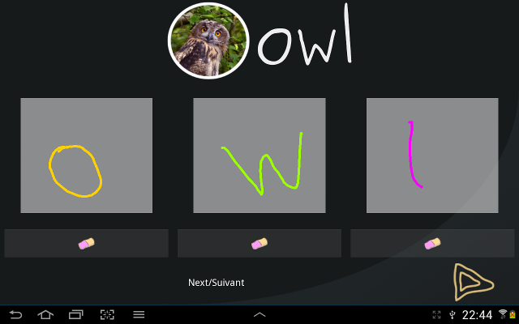

WriteMe!
========

*WriteMe!* is a simple application to collect samples of handwritten letters.

It shows pictures of animals with their names, and children must write each of the letters in
the corresponding blocks below.

Letter *trajectories* (ie, for each point drawn, a timestamp in milliseconds is
acquired) are consequently saved in annotated files.

The application is developed with [Kivy](http://kivy.org) and runs on Linux,
Windows, MacOSX, Android (and presumably iOS).

Running the application
-----------------------

You need to [install Kivy](http://kivy.org/#download) first. On Ubuntu, `sudo
apt-get install python-kivy` does the trick.

Then: clone the repository & `python main.py`.

Android
-------

The creation of an APK for Android is trivial once `python-for-android` is installed on your system.
[Instruction are here](http://kivy.org/docs/guide/packaging-android.html).

Then:`$PATH_TO_PYTHON_FOR_ANDROID_DIST/build.py --dir . --package
  org.epfl.chili.letters --name "Write Me!" --version 1.0 --icon icon.png
  --presplash presplash.png debug installd` should compile and install on the
  connected Android device the Kivy application.

Easy :-)
